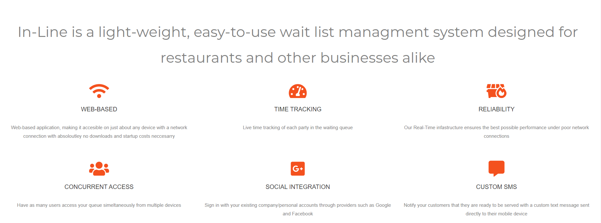
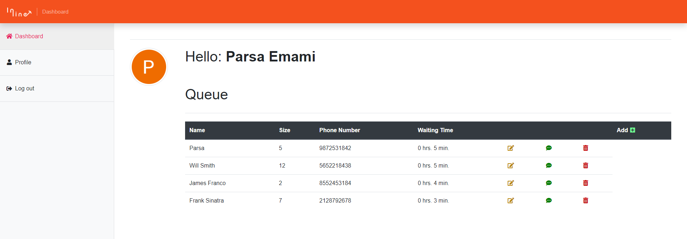
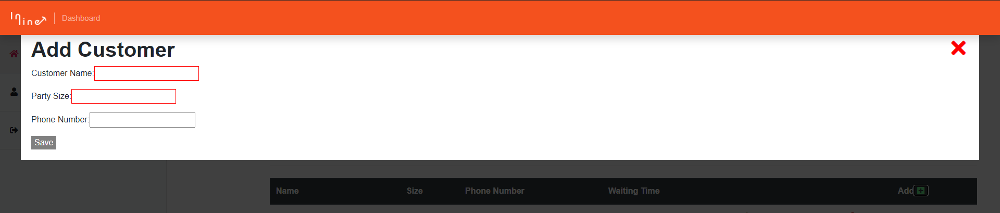
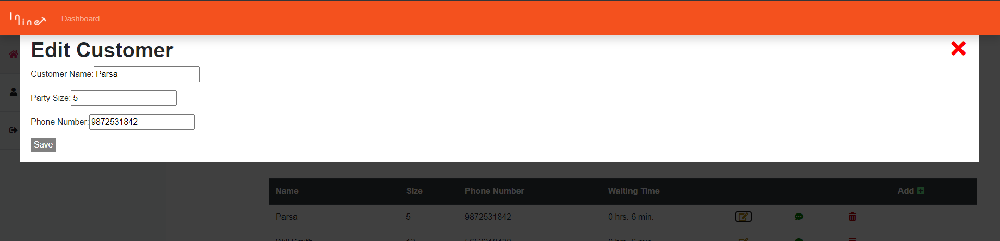
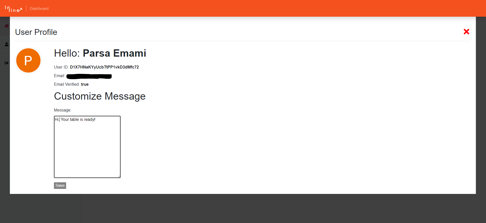
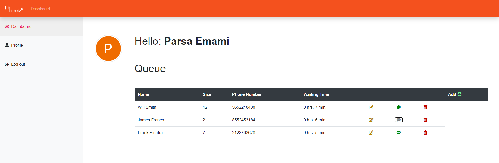

# ABOUT
In-Line is a web application that provides a light-weight, easy-to-use wait list managment system designed for restaurants and other businesses alike. Business can use this solution to create, manage, and notify a list of parties waiting to be seated. The application is built using the Angular framework, and supported by an AWS SMS web-service (depricated due to fees) and a Realtime NoSQL Document Database. 

## Installation Process
Run `npm install` to install all the required dependencies

Run `ng serve` for a dev server. Navigate to `http://localhost:4200/`. The app will automatically reload if you change any of the source files.

## Manual

### Home Page

### Why use Inline?

### User Accounts
Inline gives you the option to create an account using your email, google, or facebook account thanks to our OAuth2 integrations.

### Dashboard
As you can see below, Inline allows you to add, edit, or remove various parties from your queue while providing real-time insight on wait times stay on top of things!

### Adding Parties

### Edit Existing Parties

### Customizations 
Inline gives you the freedom to create custom SMS messages to give your notifications a personal touch. 

### Message
Once a party has been notified via our SMS functionality, the message button will turn grey to let you know they have been contacted. 

