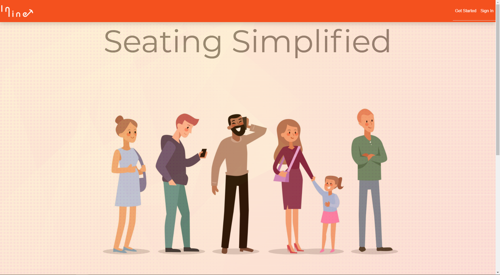

# ABOUT
In-Line is a web application that provides a light-weight, easy-to-use wait list managment system designed for restaurants and other businesses alike. Business can use this solution to create, manage, and notify a list of parties waiting to be seated. The application is built using the Angular framework, and supported by an AWS SMS web-service (depricated due to fees) and a Realtime NoSQL Document Database. 

## Installation Process
Run `npm install` to install all the required dependencies

Run `ng serve` for a dev server. Navigate to `http://localhost:4200/`. The app will automatically reload if you change any of the source files.

## Manual

### Home Page

